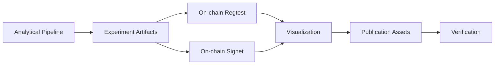

# CALIBER — Pipeline Overview

> **CALIBER: Compositional Bribery-Resilient Enforcement for Payment Channels and HTLCs**

This document provides a high-level overview of the CALIBER research artifact pipeline. It maps the paper's claims to executable experiments, describes the flow from source code to publication-ready figures, and defines the scope of each experimental stage.

## 1. Research Claims

| ID | Claim | Evidence |
|----|-------|----------|
| RQ1 | Composed CRAB+He-HTLC creates a profitable bribery interval | Analytical CLBA width \( W = v + v_{dep} - v_{col} > 0 \) |
| RQ2 | Collateral-only inflation cannot close the interval | \( W(c')\) independent of \(c'\) |
| RQ3 | CALIBER restores security at \(c^* = v + v_{dep}\) with negligible overhead | Width zero at threshold; linked ACS script-feasible on Bitcoin |

## 2. Pipeline Stages



### Stage 1 — Analytical (no Bitcoin node required)
Generates payoff decisions, parameter sweeps, attack timeline, and baseline comparisons.

**Commands:**
```powershell
go test ./...
go run ./cmd/experiment_runner
go run ./cmd/experiment_runner_m2
go run ./cmd/eval_report
go run ./cmd/publish_results
go run ./cmd/submission_report
```

### Stage 2 — On-chain Regtest (Bitcoin Core regtest)
Validates linked ACS script-path execution on a local regtest network. Free to run.

### Stage 3 — On-chain Signet (Bitcoin Core signet)
Same script validation on a public test network. Requires real testnet BTC (budget: ~0.055 BTC). Uses 2-wallet strategy: CALIBER1 (experiment, 0.06 BTC) and CALIBER2 (vault).

### Stage 4 — Visualization
Reads analytical + on-chain artifacts and generates **20 publication-quality PNGs + 3 interactive Plotly HTMLs**. Output path is configurable via `PUBLICATION_SUBDIR` env var (default: `regtest`).

### Stage 5 — Verification
Checks artifact consistency, invariants, and completeness.

## 3. Key Parameters

| Symbol | Paper Value | Artifact Value | Unit |
|--------|-------------|----------------|------|
| \(v\) | 2,500,000 | 2,500,000 | satoshi |
| \(v_{dep}\) | 500,000 | 500,000 | satoshi |
| \(v_{col}\) | 500,000 | 500,000 | satoshi |
| \(c^* = v + v_{dep}\) | 3,000,000 | 3,000,000 | satoshi |
| \(c^*_n = v + n \cdot v_{dep}\) | — | computed per \(n\) | satoshi |
| \(\kappa\) | 3–7 | 3, 5, 7 | miners |

## 4. Artifact Directory Structure

```
artifacts/
├── experiments/               # Analytical pipeline outputs
│   ├── experiment_summary.json
│   ├── parameter_sweep.csv
│   ├── attack_decisions.json
│   ├── attack_timeline.{json,csv}
│   ├── parallel_swaps_table.csv
│   ├── baseline_pipelines.json
│   ├── kappa_window_table.csv
│   └── regtest_variance.csv
├── onchain/
│   ├── regtest/fee_profiles/       # 15 run artifacts + summaries
│   │   ├── fee_*_seed_*.json       # 15 individual artifacts
│   │   ├── fee_profile_summary.{csv,json}
│   │   └── fee_profile_txids.{csv,json}
│   └── signet/fee_profiles/        # 5 run artifacts + summaries
│       ├── fee_*_seed_1.json       # 5 individual artifacts
│       ├── fee_profile_summary.{csv,json}
│       └── fee_profile_txids.{csv,json}
├── publication/
│   ├── regtest/                    # 20 PNGs (or signet/ if PUBLICATION_SUBDIR=signet)
│   └── plotly/                     # 3 interactive HTMLs
├── linked_acs_regtest.json         # Single deploy evidence (regtest)
├── linked_acs_signet.json          # Single deploy evidence (signet)
├── caliber_results.{json,md}       # Eval report
├── submission_report.md            # Reviewer-facing summary
└── tx_size_evidence.{json,md}      # Serialized tx measurements
```

## 5. Scope & Non-Claims

**What this pipeline proves:**
- Payoff/SDRBA-style accept-reject decisions for a side deal
- Deterministic CLBA replay under payoff inequalities
- Linked Taproot ACS script feasibility on regtest and signet
- Local artifact consistency through `verify_artifacts`

**What this pipeline does NOT claim:**
- A production miner bribery marketplace
- A modified Bitcoin miner client performing real censorship
- A confirmed CLBA mainnet incident
- A full routed-Lightning HTLC model
- A theorem-level multi-miner coalition game

## 6. Quick Navigation

| Document | Audience | Contents |
|----------|----------|----------|
| `01-pipeline-overview.md` | **Start here** | High-level pipeline map and scope |
| `02-quickstart.md` | Reviewers | Copy-paste commands to reproduce all results |
| `03-analytical-experiments.md` | Researchers | Detailed methodology for each experiment |
| `04-onchain-regtest.md` | Operators | Regtest execution guide |
| `05-onchain-signet.md` | Operators | Signet execution with 2-wallet strategy |
| `06-visualization.md` | Data scientists | Plot generation and interpretation |
| `07-verification.md` | Reviewers | Reproducibility checklist and invariant verification |
